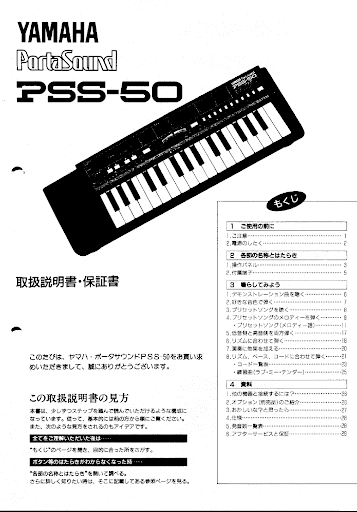

<pre>
 ______   _   _    _____   _____   _   _   ______ 
|  ____| | \ | |  / ____| |_   _| | \ | | |  ____|
| |__    |  \| | | |  __    | |   |  \| | | |__   
|  __|   | . ` | | | |_ |   | |   | . ` | |  __|  
| |____  | |\  | | |__| |  _| |_  | |\  | | |____ 
|______| |_| \_|  \_____| |_____| |_| \_| |______|
                                                                                              
</pre>

Engine is a polyphonic synthesizer built on top of [Tone.js](https://tonejs.github.io/) and the web audio API. Engine was inspired by the Yamaha PortaSound series of digital keyboards. These keyboards were low cost and often marketed towards children. Built on top of a 2-op FM synthesizer engine they have a gratifying lo-fi that lots of people will recognize.

This project is my exploration of this architecture and is not an emulation. I built it to be used in tandem with my other browser based music projects, using the [broadcast channel API](https://developer.mozilla.org/en-US/docs/Web/API/Broadcast_Channel_API) for communication. So far it responds to input from the computer keyboard and to note messages on broadcast channel "notes". The best way to get to grips with how to make sounds is to start messing with the parameters. You can learn a a bit about how FM synthesis works [here](https://en.wikipedia.org/wiki/Frequency_modulation_synthesis).

In a future version I will be adding midi functionality for note triggers and midi learn capability to Engine's parameters. This way you will be able to use it with external midi controllers.
